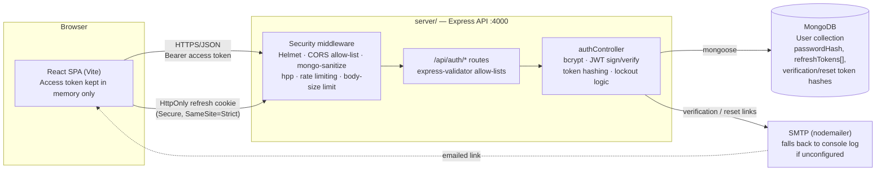

# SAMPLE-REACT-APP

A full-stack authentication sample app — Express + MongoDB API, React (Vite) frontend — covering registration, email verification, login, JWT access/refresh tokens, password reset, and password change.

> **Scope note:** this is a local-only demo/learning project, not a production Sapiens system. It uses a custom JWT credential store instead of SSO intentionally, per the Sapiens Secure Vibe-Coding elicitation for this build. See [Security notes](#security-notes) before using any of this pattern in a real deployment.

## Architecture



**Request flow in one line:** the SPA never stores the refresh token (it's an `HttpOnly` cookie the JS layer can't read) and keeps the short-lived access token in memory only; the API is the only thing that talks to MongoDB, and every sensitive action (register, login, reset) is validated, rate-limited, and logged before it touches the database.

## Features

- **Registration** with email verification (single-use, expiring, hashed token)
- **Login** with account lockout after repeated failed attempts
- **JWT auth**: short-lived access token (memory-only on the client) + rotating refresh token (`HttpOnly`/`Secure`/`SameSite=Strict` cookie, hashed at rest, reuse detection revokes all sessions)
- **Password reset** via emailed link (or console-logged link in dev — see [Email delivery](#email-delivery))
- **Password change** (in-app, requires current password) with password-history and minimum-age checks
- Security hardening: Helmet CSP, strict CORS allow-list, `express-mongo-sanitize`, `hpp`, per-route rate limiting, centralized validation/error handling, secret-redacting logger

## Project structure

```
server/            Express API
  src/
    config/        env loading + validation, MongoDB connection
    models/        Mongoose User schema
    controllers/   auth business logic
    routes/        route + validation wiring
    middleware/     auth guard, rate limiting, validation, error handling
    utils/         password/JWT/token helpers, email, logger
client/            React (Vite) frontend
  src/
    api/           fetch wrapper (access-token-in-memory, auto-refresh on 401)
    context/       AuthContext (login/logout/session state)
    components/    TopBar, AccountMenu, ProtectedRoute
    pages/         Register, Login, VerifyEmail, ForgotPassword, ResetPassword, Dashboard, ChangePassword
```

## Prerequisites

- Node.js 20+
- A running MongoDB instance (local install, Docker, Atlas, or any reachable `mongodb://` URI)

## Setup

### 1. Server

```bash
cd server
cp .env.example .env
```

Edit `server/.env`:

- `MONGODB_URI` — point at your MongoDB instance.
- `JWT_ACCESS_SECRET` / `JWT_REFRESH_SECRET` — generate two **different** random secrets:
  ```bash
  node -e "console.log(require('crypto').randomBytes(64).toString('hex'))"
  ```
- `CLIENT_ORIGIN` — the frontend origin (default `http://localhost:5173`).
- SMTP vars — optional for local dev (see [Email delivery](#email-delivery) below).

Install and run:

```bash
npm install
npm run dev      # or: npm start
```

The API listens on `http://localhost:4000` (health check: `GET /api/health`).

### 2. Client

```bash
cd client
npm install
npm run dev
```

The SPA runs on `http://localhost:5173` and proxies `/api/*` to the server (see `vite.config.js`).

## Usage

1. Open `http://localhost:5173/register`, create an account.
2. Verify the account using the link from your inbox (or the server console — see below).
3. Log in at `/login`. You'll land on `/dashboard`.
4. Use the account menu (top right) to change your password or log out.
5. Use `/forgot-password` to request a reset link if needed.

### Email delivery

If `SMTP_HOST`/`SMTP_USER`/`SMTP_PASS` aren't set in `server/.env`, the server does **not** silently pretend to send email — it logs the verification/reset link to its own console instead:

```
--- DEV EMAIL (not sent) ---
To: someone@example.com
Subject: Verify your email address
Welcome! Verify your email by visiting: http://localhost:5173/verify-email?token=...&email=...
----------------------------
```

Copy that link into your browser to continue the flow. For something closer to real email in dev, create a free test inbox at [ethereal.email](https://ethereal.email) and put those credentials in `SMTP_*`.

#### Using a self-signed SMTP server (e.g. a homelab mailcow instance)

Node.js validates TLS certificates against its own bundled CA list, not the OS trust store — so `sudo update-ca-certificates` alone does **not** make Node trust a self-signed mail server, even if `openssl` and the browser already do. Sending will fail with `self-signed certificate` until Node is told about the cert explicitly.

To fix this:

1. Get the server's CA/leaf certificate, e.g.:
   ```bash
   echo | openssl s_client -starttls smtp -connect <SMTP_HOST>:587 -showcerts
   ```
   and save the first `-----BEGIN CERTIFICATE----- ... -----END CERTIFICATE-----` block to a `.crt` file.
2. Commit it under `server/certs/` (this repo already ships `server/certs/mailcows-homelab.crt` for the default `mailcows.homelab.net` dev mail server — swap it out if you point `SMTP_HOST` at a different self-signed server).
3. `server/package.json`'s `dev`/`start` scripts already set `NODE_EXTRA_CA_CERTS=./certs/mailcows-homelab.crt`, so running `npm run dev` / `npm start` picks it up automatically — no extra steps needed as long as `server/certs/mailcows-homelab.crt` matches the cert your `SMTP_HOST` actually presents.

The bundled cert expires **2027-09-25**. After that (or if the mail server's cert changes), regenerate it with the `openssl` command above and replace `server/certs/mailcows-homelab.crt`.

### Rate limits

Auth endpoints are rate-limited (default: 20 req/15min general, 5 req/hour for `forgot-password`). If you're hammering the API during manual testing and hit `429 Too many requests`, either wait out the window or raise the limits for local dev only via `server/.env`:

```
AUTH_RATE_LIMIT_MAX=1000
SENSITIVE_RATE_LIMIT_MAX=1000
```

Never raise these in a deployed environment — see `server/.env.example` for the production-safe defaults.

## API reference

All routes are under `/api/auth`.

| Method | Path | Auth required | Purpose |
|---|---|---|---|
| POST | `/register` | No | Create account, send verification email |
| POST | `/verify-email` | No | Consume verification token |
| POST | `/resend-verification` | No | Re-send verification email |
| POST | `/login` | No | Authenticate, issue access token + refresh cookie |
| POST | `/refresh` | Refresh cookie | Rotate refresh token, issue new access token |
| POST | `/logout` | Refresh cookie | Revoke the current session |
| POST | `/forgot-password` | No | Send password reset email |
| POST | `/reset-password` | No | Consume reset token, set new password, revoke all sessions |
| POST | `/change-password` | Bearer token | Change password (requires current password) |
| GET | `/me` | Bearer token | Current user profile |

## Security notes

- Secrets live only in `server/.env` (gitignored, never committed) — regenerate the JWT secrets above rather than reusing any values from a shared example.
- This app was built following the [Sapiens Secure Vibe-Coding](https://sapiens-digital.atlassian.net/wiki/spaces/INFOSEC/pages/3864985844) controls (bcrypt hashing, input allow-lists, rate limiting, generic error responses, no plaintext secrets, etc.) as a **local-only prototype**.
- Before this goes anywhere beyond a personal machine: move it to Mend Platform SAST/SCA scanning, and re-run the Sapiens SDLC elicitation (data sensitivity, IdP/SSO, deployment target) — a real deployment should use Azure Entra ID SSO rather than this custom credential store.
